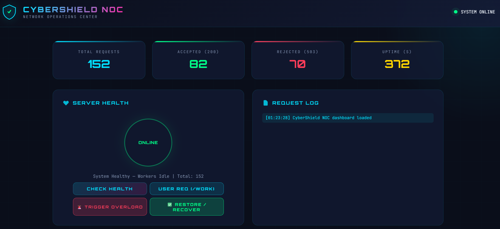
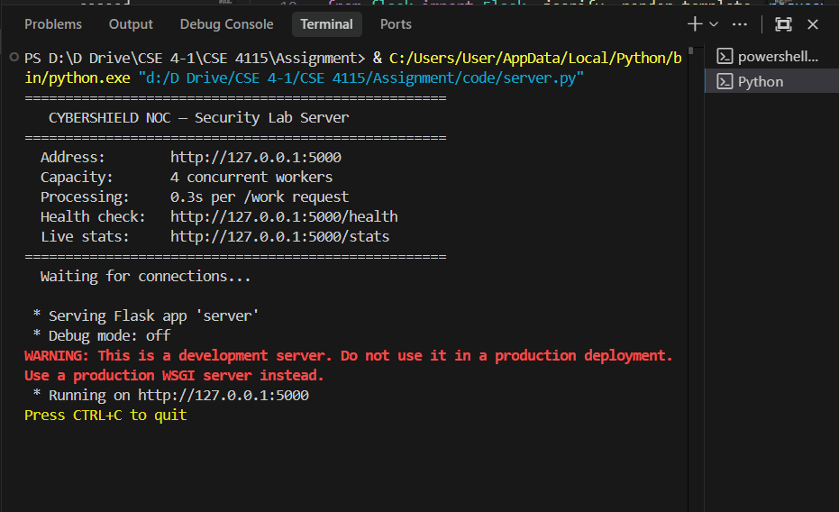
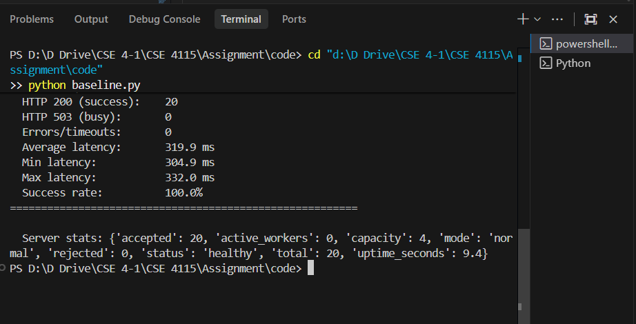
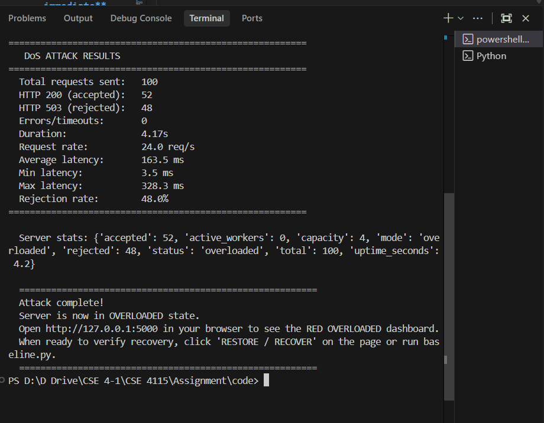
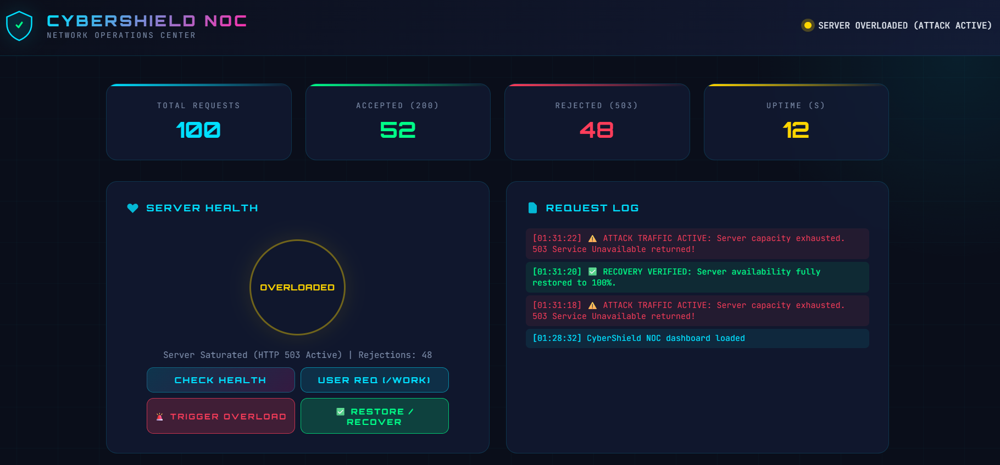
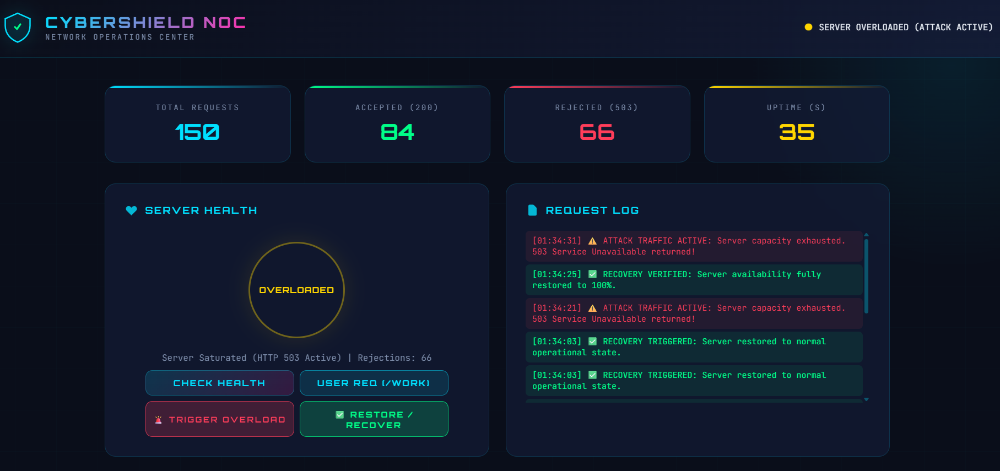
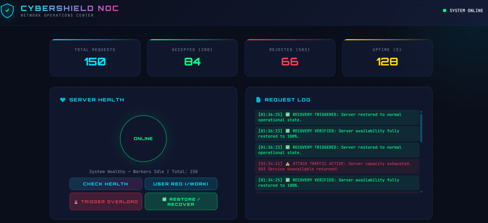

# 🛡️ Controlled DoS & DDoS Attack Simulation on a Local Web Server

[](https://www.kuet.ac.bd/)
[](https://www.kuet.ac.bd/)
[](https://www.python.org/)
[](https://flask.palletsprojects.com/)
[]()

A comprehensive laboratory investigation and empirical evaluation of **Layer-7 (Application Layer) Denial of Service (DoS)** and **Distributed Denial of Service (DDoS)** attacks. Built on an engineered, capacity-constrained target web application with real-time Network Operations Center (NOC) telemetry, mathematical queuing modeling ($M/M/c/K$), and industrial mitigation architectures.

---

## 👨‍🎓 Author & Academic Information

- **Student Name:** Md. Tariful Islam Jony
- **Roll Number:** 2107119
- **Section / Year / Term:** Section B | 4th Year, 1st Term
- **Department:** Department of Computer Science and Engineering (CSE)
- **Institution:** Khulna University of Engineering & Technology (KUET), Khulna-9203, Bangladesh
- **Course Code & Title:** CSE 4115 — Computer Security
- **Supervised By:** Ms. Dola Das, Assistant Professor, Department of CSE, KUET
- **Submission Date:** September 24, 2026

---

## 📑 Repository Structure

```plaintext
SecAssignment/
├── code/
│   ├── server.py             # Capacity-limited target server (c = 4 slots, 300ms hold)
│   ├── baseline.py           # Sequential baseline traffic measurement (20 requests)
│   ├── dos_attack.py         # Multi-threaded single-source flood (8 threads, 100 requests)
│   ├── ddos_attack.py        # Distributed multi-process botnet swarm (5 procs, 150 requests)
│   └── index.html            # CyberShield NOC telemetry dashboard UI
├── report/
│   └── 2107119_report.pdf    # Complete academic laboratory report (IEEE/KUET format)
├── ss/                       # Verified empirical screenshot evidence (ss1 to ss7)
│   ├── ss1.png               # Initial idle NOC state (System Online)
│   ├── ss2.png               # Flask server initialization on 127.0.0.1:5000
│   ├── ss3.png               # Baseline terminal benchmark (100% accepted, 319.9ms latency)
│   ├── ss4.png               # DoS attack terminal output (48.0% rejection rate)
│   ├── ss5.png               # CyberShield NOC during DoS (System Overloaded, HTTP 503)
│   ├── ss6.png               # CyberShield NOC during DDoS (44.0% rejection rate)
│   └── ss7.png               # System self-recovery and normalization (System Recovered)
└── README.md                 # Project overview and execution documentation
```

---

## 🔬 Theoretical Modeling & Mathematical Formulation

The server architecture operates under an **$M/M/c/K$ queuing system** with zero waiting queue buffer ($K = c = 4$):

- **Concurrency Limit ($c$):** 4 simultaneous worker slots protected by thread-safe atomic locks.
- **Service Delay ($t_p = 1/\mu$):** 0.30 seconds deterministic CPU/IO hold per request.
- **Maximum Server Clearance Capacity ($R_{\max}$):**
  $$R_{\max} = c \cdot \mu = \frac{4}{0.30\text{ s}} \approx 13.33\text{ requests/second}$$

### Traffic Regimes & Stability Analysis:

1. **Baseline Inbound Rate ($\lambda_{\text{base}} \approx 3.12\text{ req/s}$):**
   $$\rho = \frac{\lambda_{\text{base}}}{c \cdot \mu} \approx 0.23 < 1.0 \implies \text{Completely Stable (0\% Loss)}$$
2. **DoS Flood Inbound Rate ($\lambda_{\text{dos}} \approx 24.5\text{ req/s}$):**
   $$\text{Overload Factor} = \frac{\lambda_{\text{dos}}}{R_{\max}} \approx 184\% \implies \text{Severe Concurrency Starvation}$$
3. **Erlang-B Blocking Probability ($P_{\text{loss}}$):**
   $$P_{\text{loss}} = \frac{\frac{(\lambda/\mu)^c}{c!}}{\sum_{k=0}^{c} \frac{(\lambda/\mu)^k}{k!}} \xrightarrow{\lambda \gg c\mu} \frac{\lambda - c\mu}{\lambda} \approx 44\% - 48\%$$

---

## 📊 Empirical Laboratory Results

Telemetry recorded during sequential test phases demonstrates the transition from healthy availability to concurrency exhaustion:

| Experimental Phase | Total Requests | Accepted | Rejected (HTTP 503) | Rejection Rate (%) | Mean Latency (ms) | Operational Health |
| :--- | :---: | :---: | :---: | :---: | :---: | :--- |
| **Baseline Load** | 20 | 20 | 0 | **0.0%** | **319.9 ms** | 🟢 SYSTEM ONLINE |
| **Single-Source DoS** | 100 | 52 | 48 | **48.0%** | **182.2 ms** | 🔴 SYSTEM OVERLOADED |
| **Distributed DDoS** | 150 | 84 | 66 | **44.0%** | **196.4 ms** | 🔴 SYSTEM OVERLOADED |
| **Post-Attack Recovery**| 20 | 20 | 0 | **0.0%** | **318.5 ms** | 🟢 SYSTEM RECOVERED |

> **Key Observation on Latency Skew:**  
> The mean response latency dropped significantly during attack phases (from 319.9 ms to 182.2 ms and 196.4 ms). This occurs because rejected requests receive immediate HTTP 503 responses within 1–5 ms without entering the 300 ms processing queue, statistically lowering the aggregate average.

---

## 📸 Experimental Screenshots Gallery

| Stage | Visual Evidence | Description |
| :---: | :---: | :--- |
| **1** |  | **CyberShield NOC Baseline:** Clean dashboard state before test execution (`SYSTEM ONLINE`, 0 errors). |
| **2** |  | **Flask Server Initialized:** Terminal listener active on `127.0.0.1:5000` with capacity $c=4$. |
| **3** |  | **Baseline Benchmark Output:** 20 sequential requests; 20 accepted (100% success rate, 319.9 ms latency). |
| **4** |  | **DoS Attack Terminal Output:** 100 requests across 8 threads; 52 accepted, 48 rejected (48.0% rejection rate). |
| **5** |  | **NOC During DoS Attack:** Amber/Red alert status, capacity saturated, active HTTP 503 error surge. |
| **6** |  | **NOC During DDoS Botnet Attack:** 150 requests from 5 distributed processes; 84 accepted, 66 rejected (44.0% rejection rate). |
| **7** |  | **System Self-Recovery:** Post-attack normalization, queue backlog drained to 0, latency returned to 318.5 ms. |

---

## 🚀 Quickstart & Execution Guide

### 1. Prerequisites
Ensure Python 3.8+ is installed:
```bash
python --version
pip install flask requests
```

### 2. Clone the Repository
```bash
git clone https://github.com/jony2511/SecAssignment.git
cd SecAssignment
```

### 3. Step-by-Step Simulation Execution

#### Step 1: Launch the Target Flask Server
Open a terminal and start the server:
```bash
python code/server.py
```
*The server will initialize on `http://127.0.0.1:5000` with bounded capacity $c = 4$.*

#### Step 2: Open CyberShield NOC Dashboard
Open your web browser and navigate to:
```
http://127.0.0.1:5000
```
*You will observe the live CyberShield NOC monitoring dashboard with real-time telemetry polling.*

#### Step 3: Run Baseline Traffic Benchmark
In a second terminal, execute the baseline generator:
```bash
python code/baseline.py
```
*Dispatches 20 gentle sequential requests; verifies 100% acceptance and ~320 ms latency.*

#### Step 4: Execute Single-Source DoS Attack
```bash
python code/dos_attack.py
```
*Dispatches 100 requests via 8 concurrent threads. Observe the terminal output and dashboard turning red with HTTP 503 rejections (~48% rejection).*

#### Step 5: Execute Distributed DDoS Botnet Swarm
```bash
python code/ddos_attack.py
```
*Spawns 5 independent OS processes dispatching 150 aggregate requests. Observe sustained worker starvation (~44% rejection).*

#### Step 6: Verify Server Recovery
Click the **"✅ RESTORE / RECOVER"** button on the dashboard or run `baseline.py` again:
```bash
python code/baseline.py
```
*The server returns to `SYSTEM ONLINE (RECOVERED)` with 100% acceptance.*

---

## 🛡️ Industrial Mitigation & Defense Architecture

In production environments, mitigating application-layer starvation requires a defense-in-depth framework:

1. **Reverse-Proxy Token-Bucket Rate Limiting (NGINX / Envoy):**
   ```nginx
   # Limit each client IP to 10 requests/second with a burst buffer of 5
   limit_req_zone $binary_remote_addr zone=app_limit:10m rate=10r/s;

   server {
       location /work {
           limit_req zone=app_limit burst=5 nodelay;
           proxy_pass http://127.0.0.1:5000;
       }
   }
   ```
2. **Upstream Anycast Scrubbing (Cloudflare / AWS Shield):**  
   Distributes global volumetric floods across hundreds of edge Points of Presence (PoPs), absorbing traffic before it reaches origin servers.
3. **Behavioral Web Application Firewall (WAF):**  
   Detects botnet entropy anomalies, TLS fingerprint mismatches (JA3/JA4), and headless browser automation.
4. **Cryptographic Proof-of-Work & Managed Challenges:**  
   Issues non-intrusive computational puzzles (e.g., Cloudflare Turnstile) to suspicious clients, forcing attackers to expend CPU cycles.
5. **Horizontal Pod Autoscaling (Kubernetes HPA):**  
   Dynamically scales containerized worker replicas based on real-time CPU utilization and request queue depth.

---

## ⚖️ Legal & Ethical Compliance

- **Strict Localhost Containment:** All network sockets and HTTP floods were strictly confined to the loopback interface (`127.0.0.1`). No campus, public, or third-party networks were targeted.
- **Bangladesh Cyber Security Act 2023:** Sections 17, 19, and 34 strictly criminalize unauthorized system intrusion, denial of service, and damage to Critical Information Infrastructure (CII). This laboratory simulation was conducted strictly for academic, educational, and defensive research under faculty supervision.

---

## 📄 Academic Report

The complete, print-ready 10-page academic report is available in the `report/` directory:
- 📥 **PDF Report:** [`report/2107119_report.pdf`](report/2107119_report.pdf)
